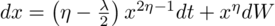
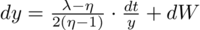
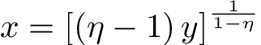
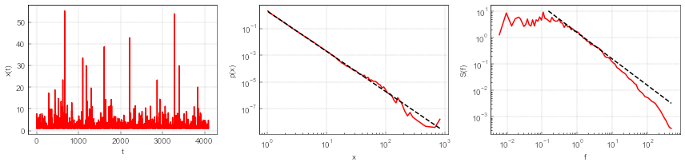

# `pyNSDE` - solving nonlinear stochastic differential equation

Here we have implemented solution of nonlinear SDE:

<div align="center">
  
</div>

In this context "solution" is understood as obtaining single sample
trajectory of desired length and discretization time step.

The numerical solution is obtained by solving Bessel process SDE:

<div align="center">
  
</div>

and applying nonlinear transformation:

<div align="center">
  
</div>

to obtain the solutions of the nonlinear SDE above.

Bessel process is solved using Euler-Maruyama method with variable time step.

## Usage

You could use this library to generate time series, which exhibit pink or
1-over-f noise. Depending on the model and simulation parameters this can be
achieved in an arbitrarily broad range of frequencies. Below follows example
with simulation results of the calculation with mostly default parameter
values.

```python
import numpy as np
import matplotlib.pyplot as plt

from pyNSDE import generate_series

from stats.pdf import MakeLogPdf
from stats.psd import MakeSegLogPsd

# simulation
series = generate_series(1048576, 1e-3, seed=123)

# calculating PDF / PSD
pdf = MakeLogPdf(series)
psd = MakeSegLogPsd(series, fs=1e3)

# creating simple visualization
plt.figure(figsize=(12,3))
plt.subplot(131)
plt.xlabel('t')
plt.ylabel('x(t)')
plt.plot(series[::256], 'r-')
plt.subplot(132)
plt.loglog()
plt.xlabel('x')
plt.ylabel('p(x)')
plt.plot(pdf[:, 0], pdf[:, 1], 'r-')
plt.plot(pdf[:, 0], 2*(pdf[:, 0]**-3), 'k--')
plt.subplot(133)
plt.loglog()
plt.xlabel('f')
plt.ylabel('S(f)')
plt.plot(psd[:, 0], psd[:, 1], 'r-')
plt.plot(psd[20:, 0], 1.5*(psd[20:, 0]**-1), 'k--')
plt.tight_layout()
plt.show()
```

<div align="center">
  
</div>

In this code snippet `stats` library was cloned from
<https://github.com/akononovicius/python-stats>.

## Related repositories

Earlier implementation of a less flexible program solving the same nonlinear
stochastic differential equation is available at
<https://github.com/JuliusRuseckas/numerical-sde-variable-step>.

<https://github.com/akononovicius/python-stats> library might be useful when
analyzing simulated time series.

## Related research

Couple of scientific review papers specific to the SDE being solved:

* B. Kaulakys and J. Ruseckas, *Stochastic nonlinear differential equation generating 1/f noise*, Phys. Rev. E **70**, 020101 (2004). doi: [10.1103/PhysRevE.70.020101](https://doi.org/10.1103/PhysRevE.70.020101). [arXiv:cond-mat/0408507 [cond-mat.stat-mech]](https://arxiv.org/abs/cond-mat/0408507).
* B. Kaulakys, J. Ruseckas, V. Gontis and M. Alaburda, *Nonlinear stochastic models of 1/f noise and power-law distributions*, Physica A **365**, 217-221 (2006). doi: [10.1016/j.physa.2006.01.017](https://doi.org/10.1016/j.physa.2006.01.017). [arXiv:cond-mat/0509626 [cond-mat.stat-mech]](https://arxiv.org/abs/cond-mat/0509626).

Recent review with variety of applications related to the SDE being solved:

* R. Kazakevičius, A. Kononovicius, B. Kaulakys, V. Gontis. *Understanding the nature of the long-range memory phenomenon in socio-economic systems*. Entropy **23**: 1125 (2021). [doi: 10.3390/e23091125](https://doi.org/10.3390/e23091125). [arXiv:2108.02506 [physics.soc-ph]](https://arxiv.org/abs/2108.02506).
